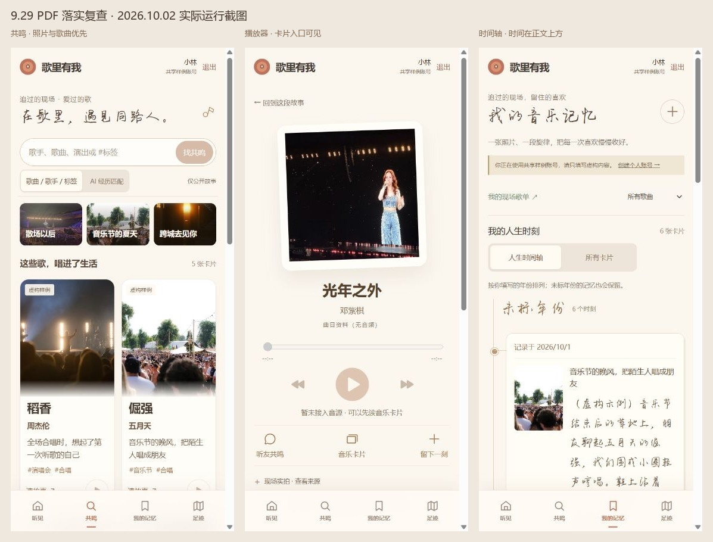

# 9.29 修改意见：逐页复查与修正

复查日期：2026-10-02。依据用户提供的《9.29修改意见总结.pdf》全部 12 页文字、截图和手绘示意，结合本地实际运行页面。页码按 PDF 阅读器顺序计数。

## 结论

上一版覆盖了多数功能入口，但视觉和操作细节没有完整落实。主要问题是：推荐卡片被过长的开场和两组入口压到首屏下面；翻面照片、正文和播放器争抢固定高度；照片多于四张时布局错误；搜索、故事、播放器之间的上下文丢失。

本次修正这些问题，并保留已经确认的“听见”五卡与中央手机构图。足迹地图、场馆场景和既有实拍素材没有重做。

## 逐项核对

| PDF 页码 | 要求 | 复查结果与本次处理 |
| --- | --- | --- |
| 1 | 围绕追星人群收拢内容 | 已落实：共鸣默认内容使用歌手、演唱会、音乐节、跨城赴约的卡片与主题入口。缩短泛化文案，首屏直接出现音乐卡片。样例明确标注为虚构。 |
| 1 | 从用户照片中选择封面 | 已有：最多九张照片，任选一张封面；本次回归验证更换封面、标题和标签会一起保存。未上传时使用歌曲现有配图。 |
| 1、4 | 保留歌手、播放按钮，以故事标题替代歌词；歌名最醒目 | 本次加强歌名与歌手字重，正文摘要、标签分层；歌曲按钮保留播放图标。有音源可播放；无音源置灰并说明，封面和“读故事”仍可打开内容。 |
| 2 | 开屏主图占主体 3/4，排除顶栏和底栏 | 已保持：移动端实测主内容高 706 CSS px，场景高 529.5 CSS px，比例 75%。仍为五张卡和一部中央手机，未改大小、角度与相对布局。 |
| 3 | 未搜索时推荐热门歌手经典歌曲的音乐故事 | **部分落实**：稻香、光年之外、泡沫、REALITY、倔强等精选样例已展示；目前没有真实用户投稿热度和排名，不能声称这是实时热门推荐。 |
| 4 | 有吸引力的故事照片做卡片封面 | 已支持用户选择照片，默认样例使用现有摄影配图；邓紫棋、刘雨昕保留本轮之前接入的近期实拍。**未实现根据真实热门故事自动评选封面**，也没有捏造点赞或热度数据。 |
| 4 | 主题围绕演唱会、音乐节、追星，推荐近期现场 | 已落实：三个摄影主题压缩为紧凑入口；日程推荐保留在卡片列表后，不再挤占首屏。实拍参考的拍摄日期与演出日期分开标注。 |
| 4 | 标签、歌手、活动、歌曲搜索，展示所有匹配卡片 | 已有公开检索接口，本次将搜索词、检索模式和筛选条件写入 URL。实际验证“邓紫棋”得到两张相关卡片，进入故事与播放器再返回，搜索词和结果仍在。关键词结果移除重复的技术性匹配说明；AI 经历匹配仍保留依据。 |
| 4 | 翻面照片更大，照片和文字交界更柔和 | 本次改为更高的照片区及渐隐边界；翻面随完整公开正文自然增高，取消窄小的内层滚动框。瀑布流根据卡片高度重排，卡片之间不重叠。 |
| 5 | 删除“这首歌，经过了 TA 的生活”冗余大标题 | 已删除且保持：详情从作者、故事标题、正文开始，不重新加入第二段开场。 |
| 6 | 可读的手写体，配图与朋友圈式多图 | 已使用用户提供的手写体。此次修复 5–9 张图错误套用四图两列布局的问题；1 张大图，2/4 张两列，其余三列。实测六图在手机上为三列。 |
| 7 | 正文完整显示 | 已落实：完整故事页和个人记忆不截断正文；翻面公开原文也不再局限于窄滚动区域。公开页只展示作者主动公开的内容，不把私人原文补进公开卡片。 |
| 7 | 标记喜欢的音乐片段并快速播放 | 已有区间与重听。本次补齐“走进这首歌”丢失终点的问题，起止时间同时传递。浏览器实测原创样例从 00:10 播放，到 00:14 停止，点击重听返回 00:10。**真实歌手歌曲仍受音源缺失限制。** |
| 7 | 页面跳转问题（原文待补充） | 针对现有可复现问题修正：搜索 → 故事 → 播放器 → 故事 → 搜索保持上下文。照片预览支持方向键、Escape、焦点返回和背景滚动锁定。PDF 未具体说明的跳转问题不假定已经全部覆盖。 |
| 8–10 | “走进这首歌”进入常规播放器 | 已有封面、歌名、歌手、进度、播放/暂停及快进/后退。本次收紧版面，让播放器与社区入口在移动首屏更容易看到。无音源保持相同布局并明确禁用，未用其他歌曲冒充。 |
| 10 | 评论入口旁增加同歌音乐卡片入口，普通播放器也具备 | 已落实：“听友共鸣”和“音乐卡片”相邻，后者直接打开同歌筛选结果。本次上移入口，避免藏在歌词与照片来源说明后。当前“听友共鸣”为故事区入口，未新增评论系统。 |
| 10 | 波形选片段 | 按 PDF 明示的“第一版先不做”保留延期；普通进度条及时间区间可用。 |
| 11 | 时间轴靠左、左图右文，有时间放正文上方 | 本次优化：保留最左时间线，时间单独放在卡片顶部；照片按固定比例显示，不再随长正文无限拉长。正文完整保留。未填写人生日期时注明“记录于”，不推测事件日期。 |
| 12 | 删除个人记忆搜索 | 已删除并回归确认；仍保留视图切换和歌曲筛选，页面没有原来的搜索输入框。 |

## 验证范围

- 前端完整测试：60 项通过。覆盖首页几何保持、隐私预览、搜索、照片、播放器、足迹既有流程等。
- 新增回归：搜索返回和片段终点、多图布局及预览焦点、无音源播放器状态。新增用例先在旧实现失败，修改后通过。
- 生产构建通过。地图相关既有大包体警告仍存在，本轮没有改地图加载策略。
- 浏览器实际检查：390 CSS px 手机视口下的首页、共鸣、翻面、全文、播放器、时间轴；320 CSS px 下标题和卡片无横向溢出。
- 照片六图验证使用独立临时组件页面，明确标注验收组合；未创建或改动真实用户投稿。
- 本轮没有改动后端业务，未把上一轮的后端测试结果冒充为本轮新跑结果。

## 仍不能宣称完成的部分

1. **真实热门内容及封面评选**：需要真实投稿和可解释的热度依据，目前为精选演示数据。
2. **真实歌手音源**：尚未提供可用播放接口或音频文件；真实曲目的播放按钮保持不可用。原创样例可以实际验证播放与区间定位。

这两项不会通过更换页面文案或生成假数据来冒充完成。
