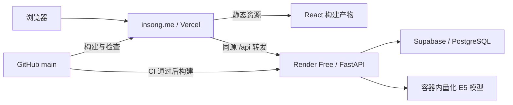

# insong.me 公网部署方案

## 目标与已确认的选择

沿用 spoken 的托管组合：Vercel 托管前端，Render Free 运行 FastAPI，Supabase Free 保存数据。使用 insong.me，部署完成后由 GitHub main 分支触发更新。成本控制在这些平台的免费额度内。

本方案处于设计阶段。正式应用目前运行在本机，insong.me 仍连接 Cloudflare 的访问测试 Worker。

## 访问与部署结构

- Cloudflare 保留域名注册和 DNS 管理。正式站点验证通过后，将根域名从测试 Worker 切换到 Vercel 提供的解析目标。
- Vercel 按 `frontend` 目录构建；深链接回退到应用入口，`/api` 路由优先转发到 Render。
- 浏览器使用相对 `/api` 地址。登录 Cookie 和照片请求沿用同一来源，不依赖跨站第三方 Cookie。
- Render 使用单进程 Uvicorn，读取平台注入的端口，健康检查为 `/api/health`。
- Supabase 创建独立的免费项目。数据库和 Render 优先选相近且双方可用的区域。

## 数据保存与兼容

本地开发继续默认使用 SQLite；云端通过 `DATABASE_URL` 使用 PostgreSQL。保持现有 HTTP 接口和记录结构。

必须补齐：

1. 数据库连接、连接池、环境变量读取及连接失败反馈。云端缺少数据库配置时启动失败，避免误用 Render 的临时 SQLite。
2. SQLite 专有的冲突插入、公开相册和标签 JSON 查询。
3. PostgreSQL 的布尔默认值、自增序列，以及带显式编号的样例初始化。
4. 初始化与迁移的幂等性：重复部署不得重新发布、恢复已删除记录，或覆盖用户修改过的内容。

云端表放在独立的 `insong` schema，供 FastAPI 的数据库连接使用。该 schema 不加入 Supabase 的 Data API 暴露列表。浏览器继续经过 FastAPI 的登录和所有权检查读取记录，不直连数据库。

照片沿用现有流程：校验、去除元数据、压缩后，将字节和所有权信息存入 PostgreSQL。读取时仍检查作者身份或有效公开快照；撤回公开后应立即失去公开访问权限。演示阶段无需增加另一套对象存储接口。数据库容量包含照片，后续规模增长时再迁到私有对象存储。

新数据库以仓库内的虚构样例初始化。本机数据库保留在原位置；已有私人记录的云端导入作为单独的数据迁移操作处理。

## 登录与请求来源

- 允许来源由环境变量配置，覆盖 `https://insong.me`、正式 Vercel 地址及本地开发地址。
- 保留不可信来源写请求的拒绝逻辑；仅配置 CORS 不能替代该检查。
- 云端会话 Cookie 使用 HttpOnly、Secure、SameSite=Lax，路径为 `/`，不绑定 Render 主机名。
- 同源转发后的登录、刷新、登出、上传和图片显示必须通过真实浏览器验证。
- 私人数据及会话响应继续禁止缓存。前端带版本的静态资源由 Vercel 分发与缓存。
- Render 的数据库连接凭证仅保存为后端环境变量，前端构建和 GitHub 仓库不含数据库凭证。

Supabase 采用 Session pooler 连接，适配 IPv4 并使用小连接池。数据库连接使用 TLS，并验证服务端证书；实施时使用平台提供的 CA 或可验证的证书链。

## E5 模型与免费后端

保留目前的 multilingual-e5-small 量化 ONNX 推理，固定已有模型版本。模型在镜像构建阶段准备，避免用户第一次搜索时下载权重。现有文件约 118 MB，文件大小不能代替运行内存测量。

- 模型按需加载，保持单个推理任务及现有超时、关键词回退。
- 在 Render 免费实例实际测量加载、长文本搜索、图片上传同时发生时的内存和响应情况。
- 验收要求正常样例的语义搜索确实成功；仅能关键词回退不能视为 AI 部署完成。
- 超时或资源暂不可用时，保留内容并显示现有回退反馈。
- Render 免费实例闲置后会休眠，首次唤醒可能较慢。公开站点需要验证冷启动后的可恢复体验；不把当前小型 Worker 的访问速度当作正式后端速度。

## GitHub 自动部署

使用当前正式仓库 `Saskia-1/TME` 的 main 分支。

- 新增 Vercel 配置，包含前端构建、SPA 路由回退及后端转发。Render 主机地址在云端服务建立后填入实际值。
- 新增后端 Dockerfile、Docker 构建排除规则和 Render Blueprint；只包含应用、必要媒体、依赖和固定版本模型。
- 新增 CI：前端测试与构建、现有后端测试，以及真实 PostgreSQL 上的关键流程测试。
- Vercel 的生产构建先运行前端检查；Render 配置为 CI 检查通过后自动部署。
- 平台完成 GitHub 授权和仓库连接后，push main 将更新前后端。数据库记录和照片独立保存，不因代码重新部署重置。
- 数据库结构变更采用向前兼容方式，允许前后端部署短暂错开。初次发布需核对两端对应提交，再切换域名。

## 实施顺序

1. 完成 PostgreSQL 适配和 SQLite 回归验证。
2. 准备容器、前端路由配置、环境变量示例及 CI。
3. 用户登录平台；创建独立免费数据库和后端服务，安全配置连接凭证。
4. 在平台默认地址验证后端持久化、E5 和前端同源转发。
5. 接入 main 自动部署，核对构建结果与部署版本。
6. 将 insong.me 切到正式前端，验证 HTTPS、手机端及国内无 VPN 访问。
7. 清理本次临时数据库、测试记录和构建辅助文件，保留正式部署配置及必要验证结果。

在 Vercel、Render、Supabase 创建项目、绑定仓库或切换域名时，以实际平台页面检查免费方案、权限和解析目标。遇到需要新的 GitHub 仓库权限、设置数据库密码或删除现有域名绑定的操作，按对应操作规则由用户确认或完成。

## 验收标准

- SQLite 现有测试、前端测试和生产构建通过。
- PostgreSQL 能初始化并重复启动，注册新用户和创建记录不会编号冲突。
- 私密记录和照片不可被其他账号或匿名用户读取；公开相册的多张照片可读，撤回后不可读。
- 歌手关注、场次收藏、歌单、标签搜索、手动资料与场次快照在云端可用。
- 创建、编辑、删除、公开与撤回在真实 PostgreSQL 上通过，超时不会静默丢失编辑内容。
- 重启或重新部署后，记录、照片、账号和收藏仍存在。
- 手机浏览器登录、刷新、退出及深链接正常，无跨站 Cookie 丢失。
- E5 样例搜索返回语义模式并显示原文证据；明确报告资源测量结果。
- GitHub main 的测试提交实际触发两端自动部署；页面和 API 对应预期版本。
- 用户在受影响的国内网络关闭 VPN 后复测；记录实际网络结果，逐项检查图片、地图、接口和上传。

## 当前资源与费用边界

- Supabase Free：每项目 500 MB 数据库，最多两个活跃免费项目，闲置项目可能暂停。实施前核对账号剩余额度。
- Render Free：存在休眠和临时文件系统。数据库和照片必须放在 Supabase；容器中仅放可从仓库或模型源重建的内容。
- Vercel、Render、Supabase均选择免费方案，不启用收费实例、收费数据库域名或附加服务。额度不足时报告具体限制，由用户决定。
- 目前本机 Docker 已安装但服务未运行。PostgreSQL 集成验证需要启动本机 Docker 或使用专门的远程测试数据库；未运行的检查不能写成通过。

## 参考

- [spoken 部署说明](https://github.com/EthanLyu30/spoken/blob/main/docs/DEPLOY.md)
- [Vercel Git 自动部署](https://vercel.com/docs/git)
- [Vercel 外部转发](https://vercel.com/docs/routing/rewrites)
- [Render 免费实例限制](https://render.com/docs/free)
- [Render 部署与 CI](https://render.com/docs/deploys)
- [Supabase 连接与 TLS](https://supabase.com/docs/guides/database/connecting-to-postgres)
- [Supabase 免费方案](https://supabase.com/pricing)
