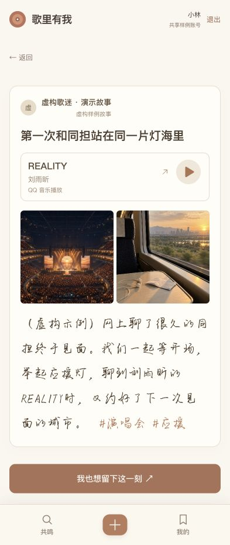
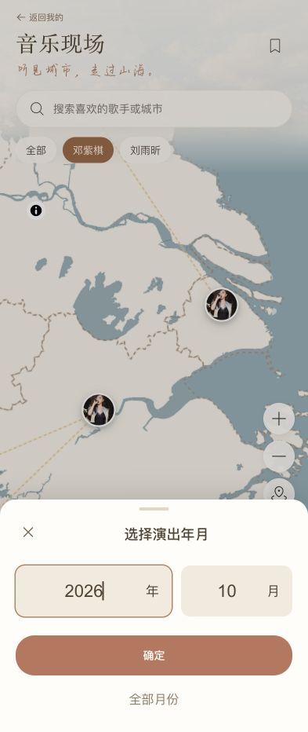

# 歌里有我｜已确认的 UI 修订记录

日期：2026-10-04。依据本轮确认稿及用户截图修改现有主程序，未整页替换项目，也未改动用户已有记忆、草稿、收藏或演出资料。

## 本轮落实

1. 地点搜索去掉输入文字周围的橙色方框，仅在圆角外框提示焦点。按现有演出目录中的城市、场馆匹配关键词，展示场馆所属城市；无结果、加载失败分别提示并可重试。
2. 未选择地点默认不标记，不再出现独立的“不标记地点”选项。删除创建页固定地点快捷标签及弹窗固定深圳选项；已有地点仍保留，可在地点行清除。
3. “我的”与“共鸣”详情共用一张阅读卡片：作者、卡片内标题、配乐歌名／歌手、照片、正文与同行标签。照片查看、正文与标签字体一致；本人编辑、删除、公开／私密操作放在卡片外。公开卡片仍只展示用户明确同意公开的内容，不自动透露私人时间。
4. 配乐区域增加浅色细边框和独立播放入口。点击真实歌曲名称打开对应 QQ 音乐歌曲页；移除卡片下方重复的配乐信息和播放器。
5. 选择歌手后，地图仅保留该歌手有演出的城市标识，并同步筛选日程；“全部”恢复完整地图。邓紫棋、刘雨昕采用各自原有头像资产；另外五位目录歌手暂无已核实头像，使用明确姓名的圆形标识，不再用普通演唱会照片冒充人像。后续补充真实头像素材可替换这些标识。
6. 月份筛选改成数字“年／月”底部弹窗，单位固定、数字可输入，默认当前中国日期的年月。确定后应用筛选；保留“全部月份”，关闭不更改筛选。往期按月份筛选，接下来仍沿用未来七天。
7. 日程爱心与现场收藏入口均可再次点击取消，并同步日程状态。取消仅影响当前账号收藏，不影响其他账号和到场记录；页面共享收藏读取与请求锁，请求中切换日程／现场面板仍正确完成，防止较早读取覆盖取消结果或同时刷新快照。读取失败可在当前面板重试，未知状态不允许写入。日程爱心统一右侧对齐。
8. 地点、时间、可见范围和年月弹窗使用淡灰遮罩，锁住背后页面滚动，关闭后恢复原位置与草稿；带滚动条的浏览器补偿其宽度，避免横向跳动。键盘焦点限制在弹窗内，关闭后回到原按钮。

## 保持原样

- 每次新启动仍展示原有开启页，开启页不加入导航。
- 共鸣、中央“＋”、我的三项导航保留；中央入口不显示“记录”文字。
- 音乐现场是独立页面，可返回原“我的”页面与筛选状态。
- 省份无缝衔接与虚线边界、拖动、双指捏合、地图＋／－按钮、现有场馆／夜场流程保留。
- 不新增歌手头像点击后展示卡片集合的概念交互，不开放好友或指定用户权限。

## 播放接入边界

已有原创示例音频可在卡片内播放／暂停，保留先前选定的时间点和片段。真实歌手歌曲目前没有 H5 可用的授权音源，入口明确显示“QQ 音乐播放”，通过官方歌曲页播放；本轮不代表已接入 QQ 音乐曲库或 H5 内完整商业歌曲播放。无音源时不会伪装正在播放。

五首直达页于 2026-10-04 用 QQ 音乐官方搜索核对原录音版本：[稻香](https://y.qq.com/n/ryqq/songDetail/003aAYrm3GE0Ac)、[光年之外](https://y.qq.com/n/ryqq/songDetail/002E3MtF0IAMMY)、[泡沫](https://y.qq.com/n/ryqq/songDetail/001X0PDf0W4lBq)、[REALITY](https://y.qq.com/n/ryqq/songDetail/000h6xTe1LRGfl)、[倔强](https://y.qq.com/n/ryqq/songDetail/004HyLC74RYiBC)。原创示例不关联商业歌曲。

## 验收

- 前端 139 项、后端 154 项测试通过；生产构建通过。独立复查 Ready，无残留重要问题。
- 真实浏览器检查统一详情卡片、地点关键词、弹窗背景不动、歌手头像筛选、年月输入、地图＋／－及返回我的。原创音频实测 readyState=4、paused=false，暂停后 paused=true。
- 360×640、393×852／932、768×1024、1280×900 检查，无横向溢出。当前页面 console error 为空；未在实体手机进行真机双指手势验收，相关回归测试仍通过。
- 真实歌曲外链未承诺 QQ 音乐在任意账号／地区可播，其版权限制由官方页面决定。
- 现有地图／场馆分包体积和 Starlette 弃用警告仍在，不影响此次通过结果。

